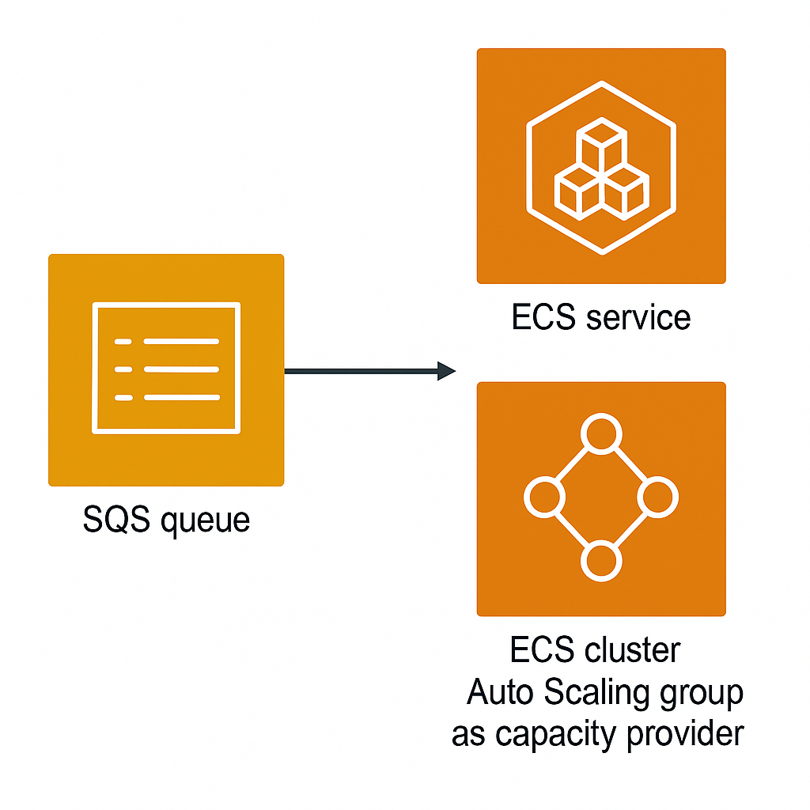

# terraform-aws-sqs-ecs

This Terraform module is designed to provision an Amazon Simple Queue Service (SQS) queue along 
with an Amazon Elastic Container Service (ECS) service that manages containerized consumers. 
The SQS queue serves as a reliable messaging service, allowing decoupled components of an application 
to communicate asynchronously.

<div style="text-align: center;">
    
</div>

The ECS service ensures that the number of running containers can dynamically adjust based on the workload, 
providing scalability and high availability for processing messages from the SQS queue.

The scaling capabilities of this module are implemented through ECS service auto-scaling policies.

The first policy monitors the average CPU usage of the EC2 host instance, maintaining it at a target level of 60% by default. 
This ensures that the containers have enough infrastructure capacity to handle the workload.

The second policy focuses on the SQS queue's message count, aiming to keep the number of messages per task 
below a threshold (default of 100). If the message count exceeds this limit, the policy triggers 
the addition of more ECS tasks to handle the increased load effectively. 
Together, these policies enable dynamic scaling based on both CPU utilization and message processing demands, 
ensuring that the application remains responsive and efficient under varying workloads.

Additionally, this module provides flexibility in how the ECS service is configured. 
It can be set up to utilize spot instances, which can significantly reduce costs while maintaining scalability. 

The module is similar to the [terraform-aws-sqs-pod](https://github.com/infrahouse/terraform-aws-sqs-pod) module,
but it allows to run a consumer from a docker image instead of deploying it on an EC2 instance.

## Usage

To utilize this module in your Terraform repository, you can call it as follows:

```hcl
module "test" {
  source  = "infrahouse/sqs-ecs/aws"
  version = "0.6.1"

  service_name                     = "sqs-test"                # A descriptive name for the service that owns the SQS queue.
  consumer_subnet_ids              = var.consumer_subnet_ids   # Where the consumer EC2 instances will be created.
  consumer_on_demand_base_capacity = 0                         # If specified, the ASG will request spot instances and this will be the minimal number of on-demand instances.
  consumer_docker_image            = "infrahouse/sqs-consumer:latest"  # Docker image to use for the consumer container.
}
```
## Requirements

| Name | Version |
|------|---------|
| <a name="requirement_aws"></a> [aws](#requirement\_aws) | ~> 5.62 |

## Providers

| Name | Version |
|------|---------|
| <a name="provider_aws"></a> [aws](#provider\_aws) | ~> 5.62 |

## Modules

| Name | Source | Version |
|------|--------|---------|
| <a name="module_asg"></a> [asg](#module\_asg) | ./modules/asg | n/a |
| <a name="module_ecs"></a> [ecs](#module\_ecs) | ./modules/ecs | n/a |

## Resources

| Name | Type |
|------|------|
| [aws_sqs_queue.queue](https://registry.terraform.io/providers/hashicorp/aws/latest/docs/resources/sqs_queue) | resource |
| [aws_caller_identity.current](https://registry.terraform.io/providers/hashicorp/aws/latest/docs/data-sources/caller_identity) | data source |
| [aws_ec2_instance_type.consumer](https://registry.terraform.io/providers/hashicorp/aws/latest/docs/data-sources/ec2_instance_type) | data source |
| [aws_region.current](https://registry.terraform.io/providers/hashicorp/aws/latest/docs/data-sources/region) | data source |
| [aws_subnet.selected](https://registry.terraform.io/providers/hashicorp/aws/latest/docs/data-sources/subnet) | data source |

## Inputs

| Name | Description | Type | Default | Required |
|------|-------------|------|---------|:--------:|
| <a name="input_consumer_ami_id"></a> [consumer\_ami\_id](#input\_consumer\_ami\_id) | AMI id for EC2 instances. By default, latest ECS optimized image. | `string` | `null` | no |
| <a name="input_consumer_asg_max_size"></a> [consumer\_asg\_max\_size](#input\_consumer\_asg\_max\_size) | Minimum number of instances in ASG. By default, calculated from var.consumer\_task\_max\_count. | `number` | `null` | no |
| <a name="input_consumer_asg_min_size"></a> [consumer\_asg\_min\_size](#input\_consumer\_asg\_min\_size) | Minimum number of instances in ASG. By default, the number of subnets. | `number` | `null` | no |
| <a name="input_consumer_docker_image"></a> [consumer\_docker\_image](#input\_consumer\_docker\_image) | A container image that will run the consumer application. | `string` | n/a | yes |
| <a name="input_consumer_extra_files"></a> [consumer\_extra\_files](#input\_consumer\_extra\_files) | Additional files to create on a host EC2 instance. | <pre>list(<br/>    object(<br/>      {<br/>        content     = string<br/>        path        = string<br/>        permissions = string<br/>      }<br/>    )<br/>  )</pre> | `[]` | no |
| <a name="input_consumer_extra_policies"></a> [consumer\_extra\_policies](#input\_consumer\_extra\_policies) | A map of additional policy ARNs to attach to the consumer instance role. | `map(string)` | `{}` | no |
| <a name="input_consumer_instance_type"></a> [consumer\_instance\_type](#input\_consumer\_instance\_type) | Consumer EC2 Instance type | `string` | `"t3a.small"` | no |
| <a name="input_consumer_keypair_name"></a> [consumer\_keypair\_name](#input\_consumer\_keypair\_name) | SSH key pair name that will be added to the consumer instance.By default, create and use a new SSH keypair. | `string` | `null` | no |
| <a name="input_consumer_on_demand_base_capacity"></a> [consumer\_on\_demand\_base\_capacity](#input\_consumer\_on\_demand\_base\_capacity) | If specified, the ASG will request spot instances and this will be the minimal number of on-demand instances. | `number` | `null` | no |
| <a name="input_consumer_root_volume_size"></a> [consumer\_root\_volume\_size](#input\_consumer\_root\_volume\_size) | Root volume size in consumer EC2 instance in Gigabytes | `number` | `30` | no |
| <a name="input_consumer_subnet_ids"></a> [consumer\_subnet\_ids](#input\_consumer\_subnet\_ids) | List of subnet ids where the consumer instances will be created. | `list(string)` | n/a | yes |
| <a name="input_consumer_target_backlog_size"></a> [consumer\_target\_backlog\_size](#input\_consumer\_target\_backlog\_size) | Target number of messages in the SQS backlog per task in ECS service. | `number` | `100` | no |
| <a name="input_consumer_target_cpu_load"></a> [consumer\_target\_cpu\_load](#input\_consumer\_target\_cpu\_load) | Target CPU load for autoscaling. | `number` | `60` | no |
| <a name="input_consumer_task_commands"></a> [consumer\_task\_commands](#input\_consumer\_task\_commands) | If specified, use this list of strings as a docker command. | `list(string)` | `null` | no |
| <a name="input_consumer_task_environment_variables"></a> [consumer\_task\_environment\_variables](#input\_consumer\_task\_environment\_variables) | Environment variables passed down to a task. | <pre>list(<br/>    object(<br/>      {<br/>        name : string<br/>        value : string<br/>      }<br/>    )<br/>  )</pre> | `[]` | no |
| <a name="input_consumer_task_execution_extra_policies"></a> [consumer\_task\_execution\_extra\_policies](#input\_consumer\_task\_execution\_extra\_policies) | A map of extra policies attached to the task execution role. The key is an arbitrary string, the value is the policy ARN. | `map(string)` | `{}` | no |
| <a name="input_consumer_task_healthcheck_command"></a> [consumer\_task\_healthcheck\_command](#input\_consumer\_task\_healthcheck\_command) | A shell command that a container runs to check if it's healthy. Exit code 0 means healthy, non-zero - unhealthy. | `string` | `"exit 0"` | no |
| <a name="input_consumer_task_max_count"></a> [consumer\_task\_max\_count](#input\_consumer\_task\_max\_count) | Maximum number of ECS tasks. By default, calculated from consumer\_asg\_max\_size. | `number` | `null` | no |
| <a name="input_consumer_task_min_count"></a> [consumer\_task\_min\_count](#input\_consumer\_task\_min\_count) | Minimal number of ECS tasks. By default, calculated from var.consumer\_asg\_min\_size. | `number` | `null` | no |
| <a name="input_consumer_task_quota_cpu"></a> [consumer\_task\_quota\_cpu](#input\_consumer\_task\_quota\_cpu) | Number of CPU units that a container is going to use. One vCPU is equal to 1024 CPU units. | `number` | `200` | no |
| <a name="input_consumer_task_quota_memory"></a> [consumer\_task\_quota\_memory](#input\_consumer\_task\_quota\_memory) | Amount of RAM in megabytes the container is going to use. | `number` | `128` | no |
| <a name="input_consumer_task_role_extra_policies"></a> [consumer\_task\_role\_extra\_policies](#input\_consumer\_task\_role\_extra\_policies) | A map of extra policies attached to the task role. The key is an arbitrary string, the value is the policy ARN. | `map(string)` | `{}` | no |
| <a name="input_consumer_task_secrets"></a> [consumer\_task\_secrets](#input\_consumer\_task\_secrets) | Secrets to pass to a container. A `name` will be the environment variable. valueFrom is a secret ARN. | <pre>list(<br/>    object(<br/>      {<br/>        name : string<br/>        valueFrom : string<br/>      }<br/>    )<br/>  )</pre> | `[]` | no |
| <a name="input_consumer_task_volumes_efs"></a> [consumer\_task\_volumes\_efs](#input\_consumer\_task\_volumes\_efs) | Map name->{file\_system\_id, container\_path} of EFS volumes defined in task and available for containers to mount. | <pre>map(<br/>    object(<br/>      {<br/>        file_system_id : string<br/>        container_path : string<br/>      }<br/>    )<br/>  )</pre> | `{}` | no |
| <a name="input_consumer_task_volumes_local"></a> [consumer\_task\_volumes\_local](#input\_consumer\_task\_volumes\_local) | Map name->{host\_path, container\_path} of local volumes defined in task and available for containers to mount. | <pre>map(<br/>    object(<br/>      {<br/>        host_path : string<br/>        container_path : string<br/>      }<br/>    )<br/>  )</pre> | `{}` | no |
| <a name="input_environment"></a> [environment](#input\_environment) | Environment name string. | `string` | `"development"` | no |
| <a name="input_fifo_queue"></a> [fifo\_queue](#input\_fifo\_queue) | If true, the queue supports FIFO queue behavior. | `bool` | `false` | no |
| <a name="input_log_retention_days"></a> [log\_retention\_days](#input\_log\_retention\_days) | Number of days you want to retain log events in a log group. | `number` | `365` | no |
| <a name="input_queue_name"></a> [queue\_name](#input\_queue\_name) | Name of the queue. | `string` | `null` | no |
| <a name="input_service_name"></a> [service\_name](#input\_service\_name) | A descriptive name for the service that owns the queue. | `string` | n/a | yes |
| <a name="input_tags"></a> [tags](#input\_tags) | A map of tags to add to resources. | `map` | `{}` | no |

## Outputs

| Name | Description |
|------|-------------|
| <a name="output_queue_arn"></a> [queue\_arn](#output\_queue\_arn) | SQS Queue ARN |
| <a name="output_queue_name"></a> [queue\_name](#output\_queue\_name) | SQS Queue name |
| <a name="output_queue_url"></a> [queue\_url](#output\_queue\_url) | SQS Queue URL |
| <a name="output_service_arn"></a> [service\_arn](#output\_service\_arn) | Consumer ECS Service ARN |
| <a name="output_service_name"></a> [service\_name](#output\_service\_name) | Consumer ECS Service name |
| <a name="output_task_execution_role_arn"></a> [task\_execution\_role\_arn](#output\_task\_execution\_role\_arn) | ECS task execution role ARN |
| <a name="output_task_role_arn"></a> [task\_role\_arn](#output\_task\_role\_arn) | ECS task role ARN |
