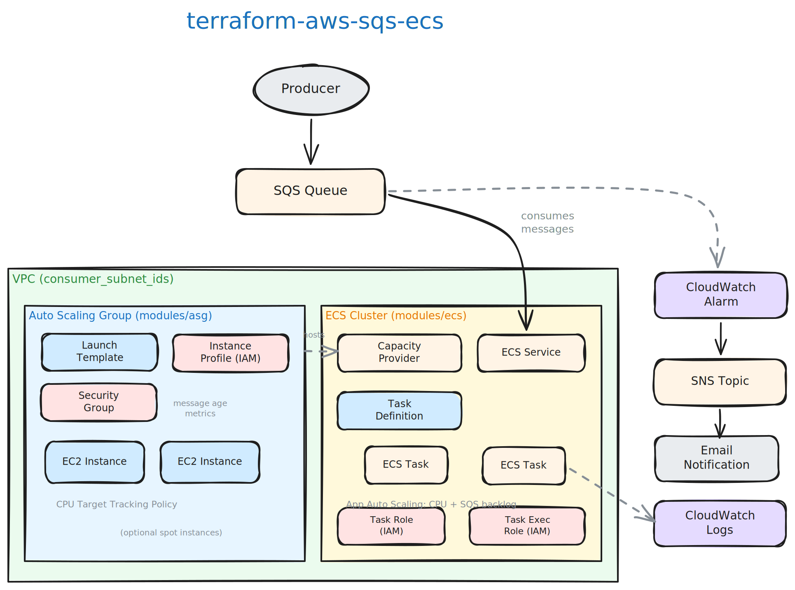

# terraform-aws-sqs-ecs

[](https://infrahouse.com/contact)
[](https://infrahouse.github.io/terraform-aws-sqs-ecs/)
[](https://registry.terraform.io/modules/infrahouse/sqs-ecs/aws/latest)
[](https://github.com/infrahouse/terraform-aws-sqs-ecs/releases/latest)
[](https://aws.amazon.com/sqs/)
[](https://aws.amazon.com/ecs/)
[](https://github.com/infrahouse/terraform-aws-sqs-ecs/actions/workflows/vuln-scanner-pr.yml)
[](LICENSE)

Terraform module for provisioning an SQS queue paired with an ECS service to run containerized queue consumers.

## Architecture



## Why This Module?

Running containerized SQS consumers on AWS requires orchestrating many services:

- **Complex scaling logic** - You need to scale based on both CPU utilization and queue depth, coordinating ECS tasks and EC2 instances
- **Capacity planning is tricky** - Calculating how many tasks fit per instance requires accounting for CPU, memory, sidecar containers, and OS overhead
- **Cost optimization** - Using spot instances for queue consumers is ideal but adds configuration complexity

This module solves these problems by:

- Providing dual auto-scaling (CPU + SQS backlog) out of the box
- Automatically calculating task placement based on instance type and task resource quotas
- Supporting spot instances with a single variable (`consumer_on_demand_base_capacity`)
- Including CloudWatch monitoring and alerting for queue health

The module is similar to [terraform-aws-sqs-pod](https://github.com/infrahouse/terraform-aws-sqs-pod), but runs consumers from Docker images instead of deploying directly on EC2 instances.

## Features

- **Dual auto-scaling** - Scales on CPU load and SQS backlog per task
- **Automatic capacity planning** - Calculates tasks per instance from CPU/memory quotas
- **Spot instance support** - Optional spot instances with configurable on-demand base
- **EFS volume support** - Mount EFS volumes in consumer containers
- **Secret injection** - Pass secrets from AWS Secrets Manager to containers
- **FIFO queue support** - Optional FIFO queue behavior
- **CloudWatch monitoring** - SQS message age alerting with email notifications

## Quick Start

```hcl
module "sqs_consumer" {
  source  = "registry.infrahouse.com/infrahouse/sqs-ecs/aws"
  version = "2.0.1"

  service_name                     = "my-consumer"
  consumer_subnet_ids              = var.private_subnet_ids
  consumer_docker_image            = "my-org/my-consumer:latest"
  alert_notification_email         = "alerts@example.com"
  consumer_on_demand_base_capacity = 0  # Use spot instances
}
```

## Documentation

Full documentation is available at [infrahouse.github.io/terraform-aws-sqs-ecs](https://infrahouse.github.io/terraform-aws-sqs-ecs/).

- [Getting Started](https://infrahouse.github.io/terraform-aws-sqs-ecs/getting-started/) - Prerequisites and first deployment
- [Architecture](https://infrahouse.github.io/terraform-aws-sqs-ecs/architecture/) - How scaling and placement work
- [Configuration](https://infrahouse.github.io/terraform-aws-sqs-ecs/configuration/) - All variables explained
- [Examples](https://infrahouse.github.io/terraform-aws-sqs-ecs/examples/) - Common use cases
- [Troubleshooting](https://infrahouse.github.io/terraform-aws-sqs-ecs/troubleshooting/) - Common issues

<!-- BEGIN_TF_DOCS -->

## Requirements

| Name | Version |
|------|---------|
| <a name="requirement_aws"></a> [aws](#requirement\_aws) | >= 5.62, < 7 |

## Providers

| Name | Version |
|------|---------|
| <a name="provider_aws"></a> [aws](#provider\_aws) | 6.41.0 |

## Modules

| Name | Source | Version |
|------|--------|---------|
| <a name="module_asg"></a> [asg](#module\_asg) | ./modules/asg | n/a |
| <a name="module_ecs"></a> [ecs](#module\_ecs) | ./modules/ecs | n/a |
| <a name="module_scaling"></a> [scaling](#module\_scaling) | ./modules/scaling | n/a |

## Resources

| Name | Type |
|------|------|
| [aws_cloudwatch_dashboard.this](https://registry.terraform.io/providers/hashicorp/aws/latest/docs/resources/cloudwatch_dashboard) | resource |
| [aws_cloudwatch_metric_alarm.sqs_age_alarm](https://registry.terraform.io/providers/hashicorp/aws/latest/docs/resources/cloudwatch_metric_alarm) | resource |
| [aws_sns_topic.sqs_alarms](https://registry.terraform.io/providers/hashicorp/aws/latest/docs/resources/sns_topic) | resource |
| [aws_sns_topic_subscription.email_subscription](https://registry.terraform.io/providers/hashicorp/aws/latest/docs/resources/sns_topic_subscription) | resource |
| [aws_sqs_queue.queue](https://registry.terraform.io/providers/hashicorp/aws/latest/docs/resources/sqs_queue) | resource |
| [aws_caller_identity.current](https://registry.terraform.io/providers/hashicorp/aws/latest/docs/data-sources/caller_identity) | data source |
| [aws_ec2_instance_type.consumer](https://registry.terraform.io/providers/hashicorp/aws/latest/docs/data-sources/ec2_instance_type) | data source |
| [aws_region.current](https://registry.terraform.io/providers/hashicorp/aws/latest/docs/data-sources/region) | data source |
| [aws_subnet.selected](https://registry.terraform.io/providers/hashicorp/aws/latest/docs/data-sources/subnet) | data source |

## Inputs

| Name | Description | Type | Default | Required |
|------|-------------|------|---------|:--------:|
| <a name="input_alert_notification_email"></a> [alert\_notification\_email](#input\_alert\_notification\_email) | Email address to receive alert notifications. | `string` | n/a | yes |
| <a name="input_cloudwatch_agent_image"></a> [cloudwatch\_agent\_image](#input\_cloudwatch\_agent\_image) | CloudWatch agent container image. | `string` | `"amazon/cloudwatch-agent:latest"` | no |
| <a name="input_consumer_ami_id"></a> [consumer\_ami\_id](#input\_consumer\_ami\_id) | AMI id for EC2 instances. By default, latest ECS optimized image. | `string` | `null` | no |
| <a name="input_consumer_asg_max_size"></a> [consumer\_asg\_max\_size](#input\_consumer\_asg\_max\_size) | Minimum number of instances in ASG. By default, calculated from var.consumer\_task\_max\_count. | `number` | `null` | no |
| <a name="input_consumer_asg_min_size"></a> [consumer\_asg\_min\_size](#input\_consumer\_asg\_min\_size) | Minimum number of instances in ASG. By default, the number of subnets. | `number` | `null` | no |
| <a name="input_consumer_docker_image"></a> [consumer\_docker\_image](#input\_consumer\_docker\_image) | A container image that will run the consumer application. | `string` | n/a | yes |
| <a name="input_consumer_extra_files"></a> [consumer\_extra\_files](#input\_consumer\_extra\_files) | Additional files to create on a host EC2 instance. | <pre>list(<br/>    object(<br/>      {<br/>        content     = string<br/>        path        = string<br/>        permissions = string<br/>      }<br/>    )<br/>  )</pre> | `[]` | no |
| <a name="input_consumer_extra_policies"></a> [consumer\_extra\_policies](#input\_consumer\_extra\_policies) | A map of additional policy ARNs to attach to the consumer instance role. | `map(string)` | `{}` | no |
| <a name="input_consumer_instance_type"></a> [consumer\_instance\_type](#input\_consumer\_instance\_type) | Consumer EC2 Instance type | `string` | `"t3a.small"` | no |
| <a name="input_consumer_keypair_name"></a> [consumer\_keypair\_name](#input\_consumer\_keypair\_name) | SSH key pair name that will be added to the consumer instance.By default, create and use a new SSH keypair. | `string` | `null` | no |
| <a name="input_consumer_on_demand_base_capacity"></a> [consumer\_on\_demand\_base\_capacity](#input\_consumer\_on\_demand\_base\_capacity) | If specified, the ASG will request spot instances and this will be the minimal number of on-demand instances. | `number` | `null` | no |
| <a name="input_consumer_root_volume_size"></a> [consumer\_root\_volume\_size](#input\_consumer\_root\_volume\_size) | Root volume size in consumer EC2 instance in Gigabytes | `number` | `30` | no |
| <a name="input_consumer_subnet_ids"></a> [consumer\_subnet\_ids](#input\_consumer\_subnet\_ids) | List of subnet ids where the consumer instances will be created. | `list(string)` | n/a | yes |
| <a name="input_consumer_target_backlog_size"></a> [consumer\_target\_backlog\_size](#input\_consumer\_target\_backlog\_size) | Target number of messages in the SQS backlog per task in ECS service. | `number` | `100` | no |
| <a name="input_consumer_target_cpu_load"></a> [consumer\_target\_cpu\_load](#input\_consumer\_target\_cpu\_load) | Target CPU load for autoscaling. | `number` | `60` | no |
| <a name="input_consumer_task_commands"></a> [consumer\_task\_commands](#input\_consumer\_task\_commands) | If specified, use this list of strings as a docker command. | `list(string)` | `null` | no |
| <a name="input_consumer_task_environment_variables"></a> [consumer\_task\_environment\_variables](#input\_consumer\_task\_environment\_variables) | Environment variables passed down to a task. | <pre>list(<br/>    object(<br/>      {<br/>        name : string<br/>        value : string<br/>      }<br/>    )<br/>  )</pre> | `[]` | no |
| <a name="input_consumer_task_execution_extra_policies"></a> [consumer\_task\_execution\_extra\_policies](#input\_consumer\_task\_execution\_extra\_policies) | A map of extra policies attached to the task execution role. The key is an arbitrary string, the value is the policy ARN. | `map(string)` | `{}` | no |
| <a name="input_consumer_task_healthcheck_command"></a> [consumer\_task\_healthcheck\_command](#input\_consumer\_task\_healthcheck\_command) | A shell command that a container runs to check if it's healthy. Exit code 0 means healthy, non-zero - unhealthy. | `string` | `"exit 0"` | no |
| <a name="input_consumer_task_max_count"></a> [consumer\_task\_max\_count](#input\_consumer\_task\_max\_count) | Maximum number of ECS tasks. By default, calculated from consumer\_asg\_max\_size. | `number` | `null` | no |
| <a name="input_consumer_task_min_count"></a> [consumer\_task\_min\_count](#input\_consumer\_task\_min\_count) | Minimal number of ECS tasks. By default, calculated from var.consumer\_asg\_min\_size. | `number` | `null` | no |
| <a name="input_consumer_task_quota_cpu"></a> [consumer\_task\_quota\_cpu](#input\_consumer\_task\_quota\_cpu) | Number of CPU units that a container is going to use. One vCPU is equal to 1024 CPU units. | `number` | `200` | no |
| <a name="input_consumer_task_quota_memory"></a> [consumer\_task\_quota\_memory](#input\_consumer\_task\_quota\_memory) | Amount of RAM in megabytes the container is going to use. | `number` | `128` | no |
| <a name="input_consumer_task_role_extra_policies"></a> [consumer\_task\_role\_extra\_policies](#input\_consumer\_task\_role\_extra\_policies) | A map of extra policies attached to the task role. The key is an arbitrary string, the value is the policy ARN. | `map(string)` | `{}` | no |
| <a name="input_consumer_task_secrets"></a> [consumer\_task\_secrets](#input\_consumer\_task\_secrets) | Secrets to pass to a container. A `name` will be the environment variable. valueFrom is a secret ARN. | <pre>list(<br/>    object(<br/>      {<br/>        name : string<br/>        valueFrom : string<br/>      }<br/>    )<br/>  )</pre> | `[]` | no |
| <a name="input_consumer_task_volumes_efs"></a> [consumer\_task\_volumes\_efs](#input\_consumer\_task\_volumes\_efs) | Map name->{file\_system\_id, container\_path} of EFS volumes defined in task and available for containers to mount. | <pre>map(<br/>    object(<br/>      {<br/>        file_system_id : string<br/>        container_path : string<br/>      }<br/>    )<br/>  )</pre> | `{}` | no |
| <a name="input_consumer_task_volumes_local"></a> [consumer\_task\_volumes\_local](#input\_consumer\_task\_volumes\_local) | Map name->{host\_path, container\_path} of local volumes defined in task and available for containers to mount. | <pre>map(<br/>    object(<br/>      {<br/>        host_path : string<br/>        container_path : string<br/>      }<br/>    )<br/>  )</pre> | `{}` | no |
| <a name="input_enable_cloudwatch_logs"></a> [enable\_cloudwatch\_logs](#input\_enable\_cloudwatch\_logs) | Deploy a CloudWatch agent daemon on every EC2 instance in this cluster.<br/>Tails host log files (/var/log/messages, /var/log/dmesg) into CloudWatch log groups.<br/><br/>Does not affect container stdout/stderr, which is always shipped via the Docker<br/>awslogs driver configured on the task definition. | `bool` | `true` | no |
| <a name="input_enable_vector_agent"></a> [enable\_vector\_agent](#input\_enable\_vector\_agent) | Deploy a Vector Agent daemon on every EC2 instance in this cluster.<br/>Collects container logs (via Docker socket) and host metrics, forwards to a<br/>Vector Aggregator. Requires vector\_aggregator\_endpoint or vector\_agent\_config. | `bool` | `false` | no |
| <a name="input_environment"></a> [environment](#input\_environment) | Environment name string. | `string` | n/a | yes |
| <a name="input_fifo_queue"></a> [fifo\_queue](#input\_fifo\_queue) | If true, the queue supports FIFO queue behavior. | `bool` | `false` | no |
| <a name="input_log_retention_days"></a> [log\_retention\_days](#input\_log\_retention\_days) | Number of days you want to retain log events in a log group. | `number` | `365` | no |
| <a name="input_queue_name"></a> [queue\_name](#input\_queue\_name) | Name of the queue. | `string` | `null` | no |
| <a name="input_service_name"></a> [service\_name](#input\_service\_name) | A descriptive name for the service that owns the queue. | `string` | n/a | yes |
| <a name="input_tags"></a> [tags](#input\_tags) | A map of tags to add to resources. | `map(string)` | `{}` | no |
| <a name="input_vector_agent_config"></a> [vector\_agent\_config](#input\_vector\_agent\_config) | Custom Vector Agent config (YAML string). When provided, replaces the<br/>built-in default config template entirely. | `string` | `null` | no |
| <a name="input_vector_agent_image"></a> [vector\_agent\_image](#input\_vector\_agent\_image) | Vector Agent container image. | `string` | `"timberio/vector:0.43.1-alpine"` | no |
| <a name="input_vector_agent_task_policy_arns"></a> [vector\_agent\_task\_policy\_arns](#input\_vector\_agent\_task\_policy\_arns) | List of IAM policy ARNs to attach to the Vector Agent task role.<br/>The default config (Docker logs + host metrics forwarded to an aggregator)<br/>needs no AWS permissions. Add policies here if your Vector config uses AWS<br/>sinks (S3, CloudWatch, Kinesis, etc.). | `list(string)` | `[]` | no |
| <a name="input_vector_aggregator_endpoint"></a> [vector\_aggregator\_endpoint](#input\_vector\_aggregator\_endpoint) | Vector Aggregator address (host:port) for the agent to forward data to.<br/>Used by the default config template. Ignored if vector\_agent\_config is set.<br/><br/>Example: "vector-aggregator.sandbox.tinyfish.io:6000" | `string` | `null` | no |

## Outputs

| Name | Description |
|------|-------------|
| <a name="output_queue_arn"></a> [queue\_arn](#output\_queue\_arn) | SQS Queue ARN |
| <a name="output_queue_name"></a> [queue\_name](#output\_queue\_name) | SQS Queue name |
| <a name="output_queue_url"></a> [queue\_url](#output\_queue\_url) | SQS Queue URL |
| <a name="output_service_arn"></a> [service\_arn](#output\_service\_arn) | Consumer ECS Service ARN |
| <a name="output_service_name"></a> [service\_name](#output\_service\_name) | Consumer ECS Service name |
| <a name="output_task_execution_role_arn"></a> [task\_execution\_role\_arn](#output\_task\_execution\_role\_arn) | ECS task execution role ARN |
| <a name="output_task_role_arn"></a> [task\_role\_arn](#output\_task\_role\_arn) | ECS task role ARN |
<!-- END_TF_DOCS -->

## Contributing

See [CONTRIBUTING.md](CONTRIBUTING.md) for development setup and guidelines.

## License

[Apache 2.0](LICENSE)
